## DESCRIPTION OF EACH APP

## RECIPE APP

This app is perfect for people who are really interested in cooking. It helps users easily find, save, and find another recipes. Users can search by recipe name, and the app suggests popular recipes as they type. Recipes are shown in a grid with pictures, names, and preparation times. Each recipe card also has a short description. By clicking on a recipe, users can see all details, including ingredients, amounts, step-by-step instructions, and nutrition info. Users can save recipes to a “Favorites” list, which is located at the navigation bar as the another page that saves the recepits even after refreshing the page by local storage. In this app we use the Spoonacular Recipe API to provide reliable and varied recipe options.

## MOVIES APP

This app gives user to search for movies, to see some details of dates raiting, and make a personal watchlist. It has a search bar with auto-suggestions, so users can find movies by title quickly. Movies appear in a grid with posters. Users can sort movies by popularity, release date, or rating. When clicking on a movie, users see more details like the synopsis, rating, runtime. Users can add movies to a watchlist, and local storage keeps the list saved after refreshing. The app is powered by The Movie Database (TMDb) API, giving users a great movie browsing experience.

## Weather App

The Weather App shows current weather and a 5-day forecast to help users stay up-to-date with the weather. Users can search for a city, and the app suggests popular locations as they type. The app displays temperature, humidity, wind speed, and weather conditions with an icon. The 5-day forecast shows daily highs, lows, and conditions, helping users plan for the week. Users can also check the weather for their current location using geolocation. They can switch between Celsius and Fahrenheit as well. The app uses the OpenWeatherMap API for accurate weather information.

## Running the Applications
Follow these steps to run each application:

1. RECIPE APP
   - Navigate to the folder `recipe_app_folder/pages/homePage.html`.
   - If you have extension Live Server, you can from this file run the extension. Otherwise, you can open the homePage.html file directly in your browser by double-clicking on the file. This will load the app locally, though some features such as API calls may not work correctly without a server environment.

2. MOVIES APP
   - Navigate to the folder `movies_app_folder/pages/index.html`.
   - If you have extension Live Server, you can from this file run the extension. Otherwise, you can open the index.html file directly in your browser by double-clicking on the file. This will load the app locally, though some features such as API calls may not work correctly without a server environment.

3. WEATHER APP
   - Navigate to the folder `weather_app_folder/pages/index.html`.
   - If you have extension Live Server, you can from this file run the extension. Otherwise, you can open the index.html file directly in your browser by double-clicking on the file. This will load the app locally, though some features such as API calls may not work correctly without a server environment.

## Screenshots
Below are screenshots of the applications:

### RECIPE APP Screenshots

1. 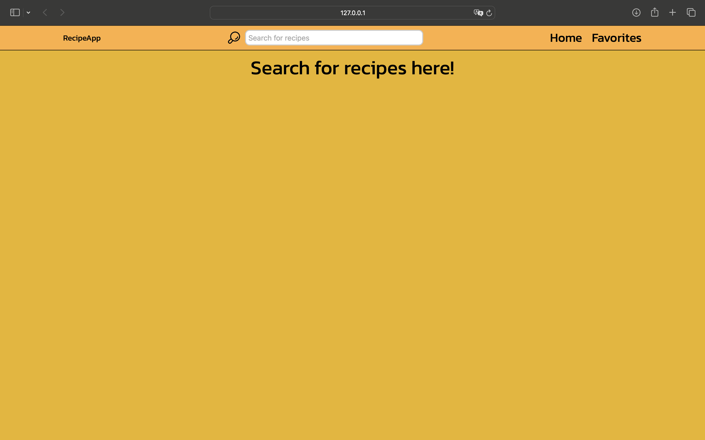
2. 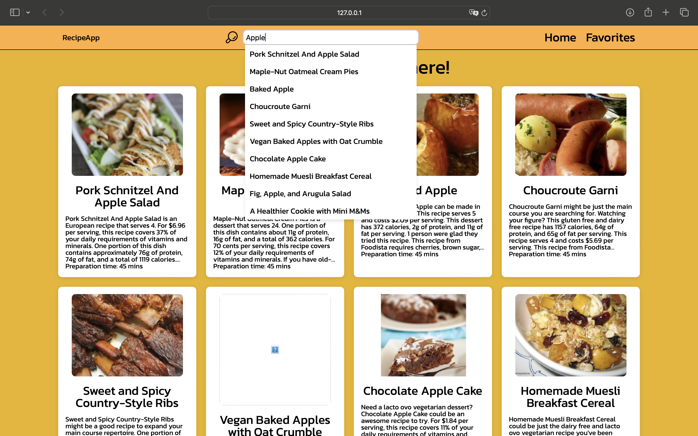
3. 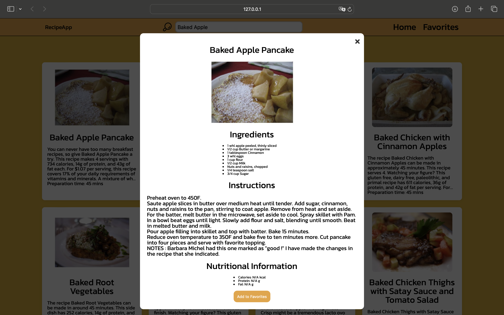
4. 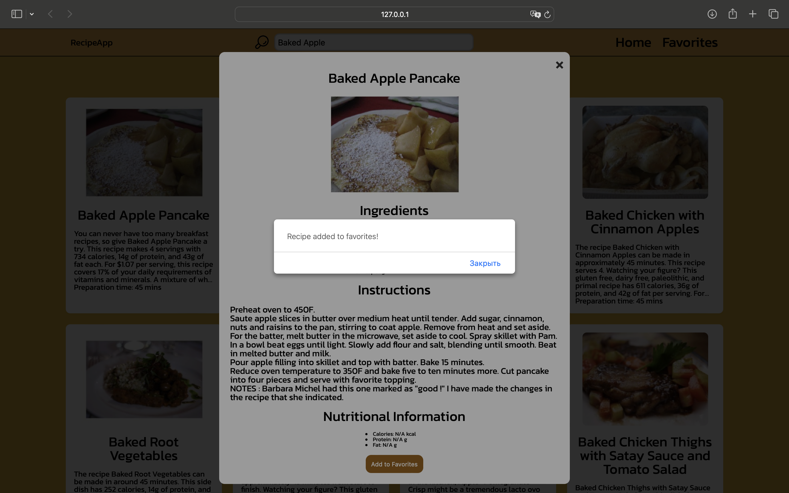
5. 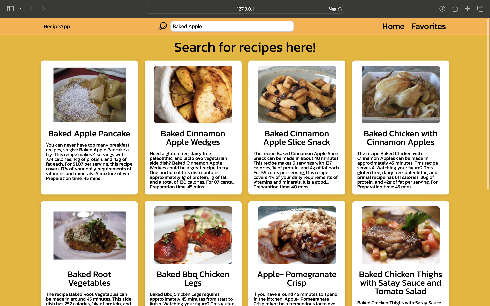
6. 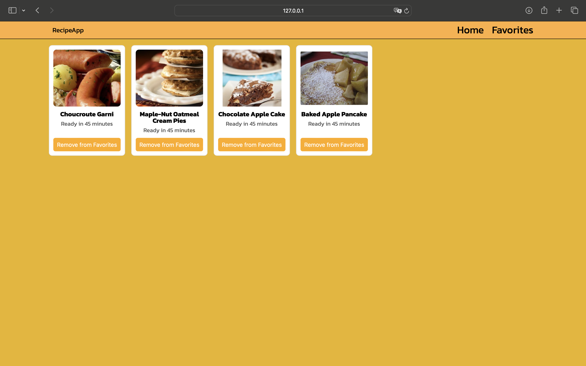
7. 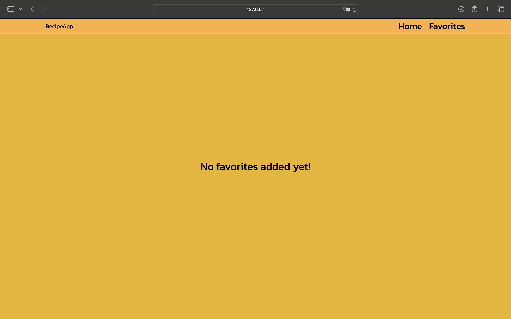

### MOVIES APP Screenshots

1. 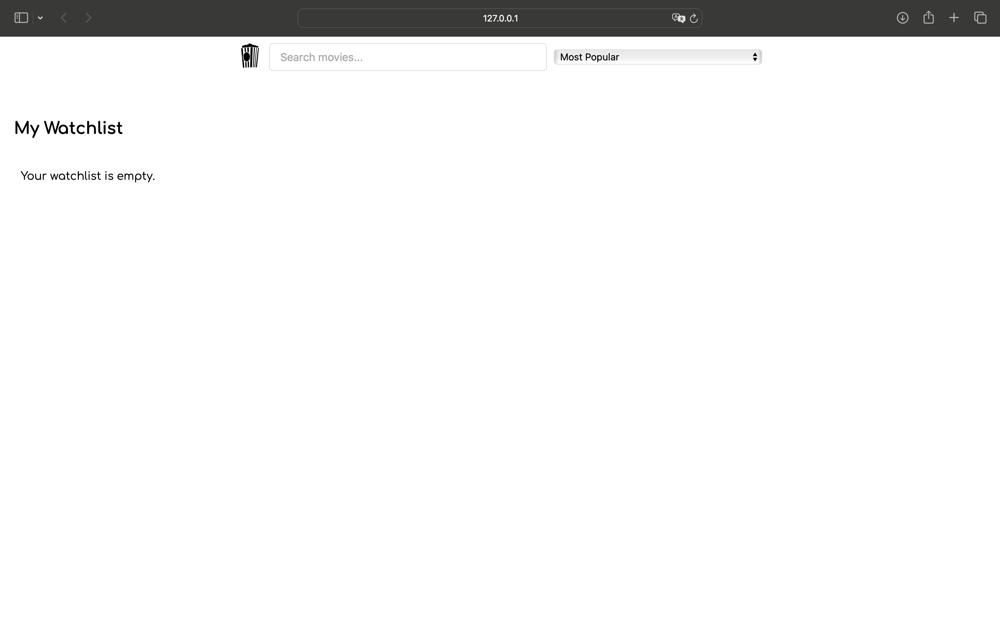
2. 
3. 
4. 
5. 
6. 
7. 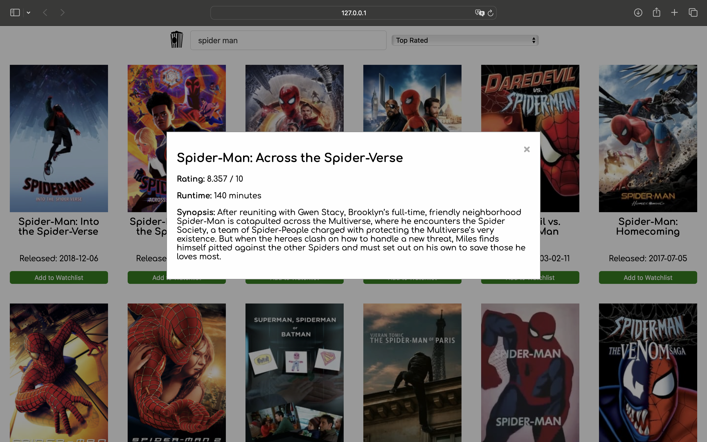
8. 
9. 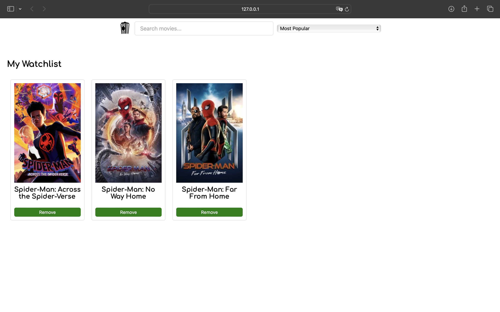

### WEATHER APP Screenshots

1. 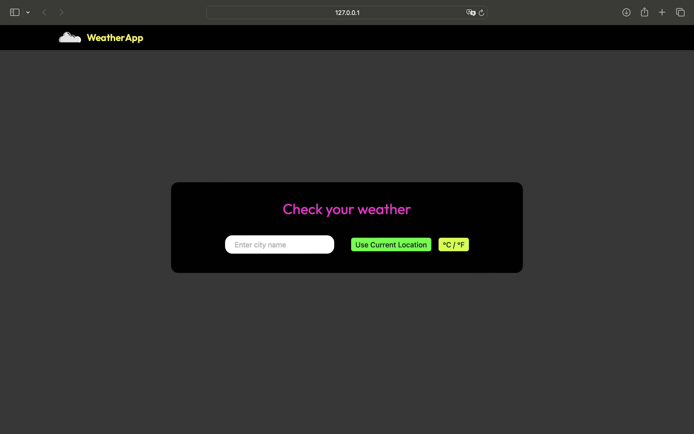
2. 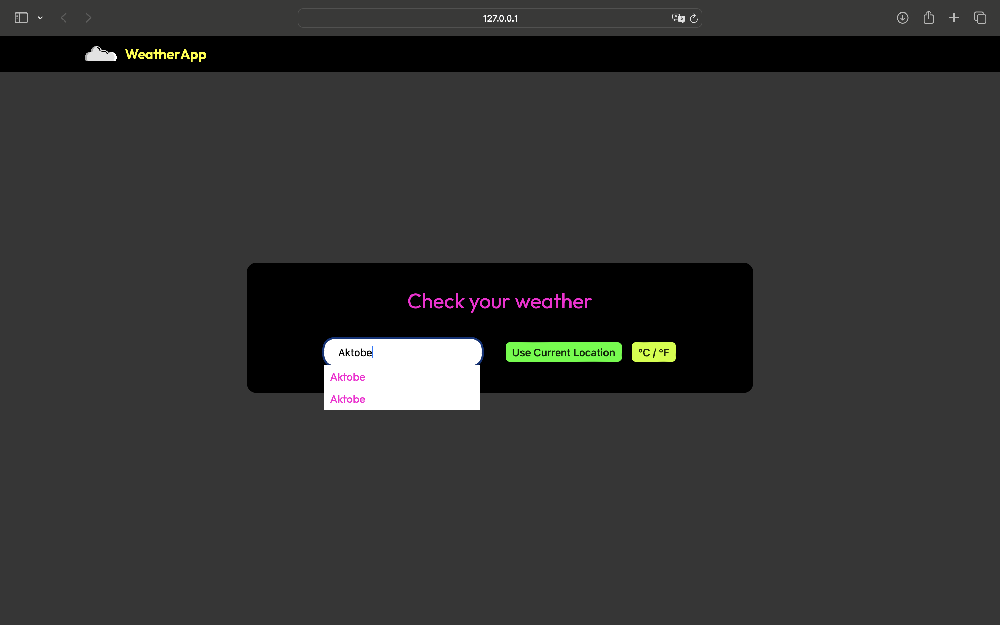
3. 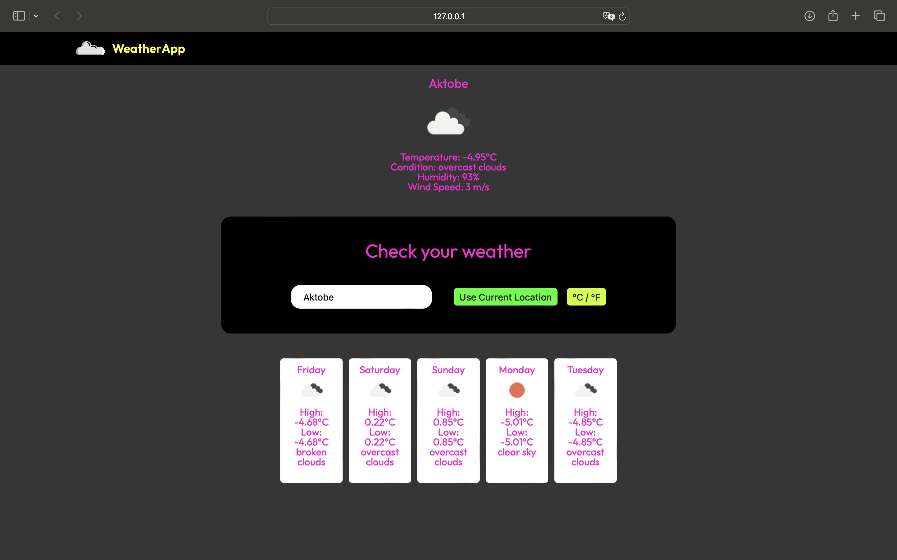
4. 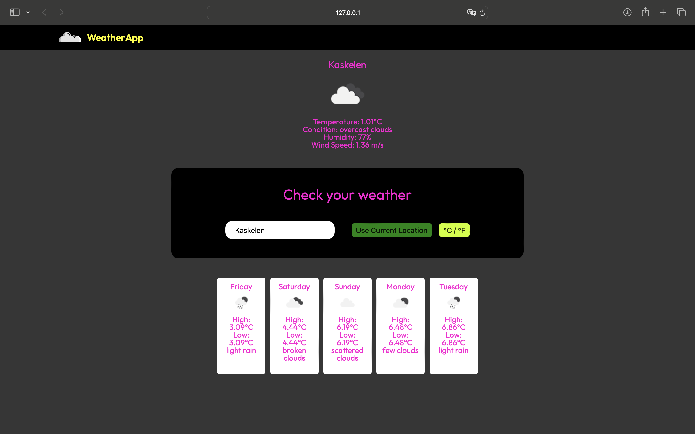
5. 
6. 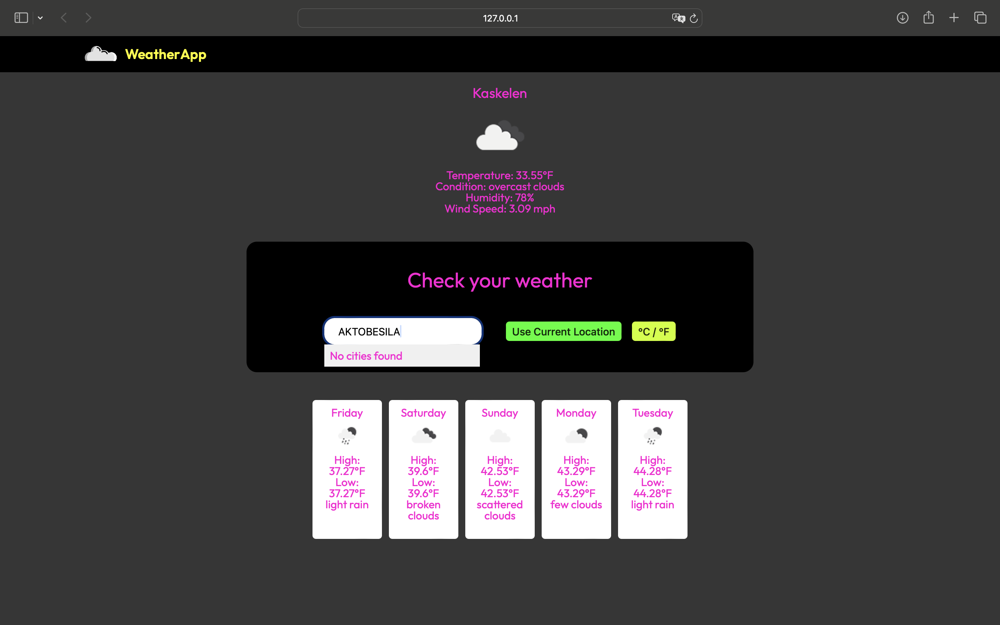
